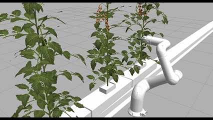
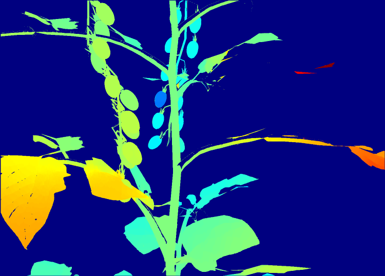

# Tomato Harvesting Robot Arm with Stereo Camera using NanoDet

A ROS2-based robotic system for autonomous tomato harvesting using stereo vision and the NanoDet model for object detection.

## Features
- **Stereo Vision**: Dual camera setup for 3D perception
- **NanoDet Model**: Lightweight object detection for tomato identification
- **NeuroMeka Indy7**: 6-DOF collaborative robot arm
- **Gazebo Simulation**: Full simulation environment with physics
- **Web Interface**: Flask-based monitoring and control
- **QR Code Support**: Navigation and tracking capabilities

## Installation

### ROS2 Dependencies
```bash
sudo apt install ros-humble-camera-info-manager
sudo apt-get install ros-humble-stereo-image-proc
sudo apt install ros-humble-image-pipeline
sudo apt install ros-humble-ros-ign-bridge
sudo apt-get install ros-humble-ign-ros2-control
sudo apt install libompl-dev
```

### Python Dependencies
```bash
pip install opencv-python-headless
pip install numpy==1.26.4
pip install ttkbootstrap
pip install flask
pip install pyngrok
pip install qrcode[pil]
pip install customtkinter
pip install onnxruntime
pip install flask-socketio
```

### NeuroMeka Indy ROS2
Install the NeuroMeka Indy ROS2 package according to their official documentation.

## Quick Start

Launch the simulation environment:
```bash
ros2 launch indy_moveit indy_moveit_gazebo.launch.py indy_type:=indy7
```

## Demo

### Video Demo


### Disparity Map Visualization


## Tech Stack
- **Language**: Python, C++, CMake, Shell
- **Framework**: ROS2 Humble
- **Simulation**: Gazebo
- **Detection**: NanoDet
- **Robot**: NeuroMeka Indy7

## Repository Structure

### Complete Directory Tree
```
src/
└── indy-ros2/
    ├── msg/                              # Custom ROS2 Message Definitions
    │   ├── res_msgs/
    │   ├── config_manager/
    │   ├── collect_msgs/
    │   ├── connect_msgs/
    │   ├── yolov8_msgs/
    │   ├── position_signal_msgs/
    │   ├── depth_signal_msgs/
    │   ├── skip_signal_msgs/
    │   ├── move_signal_msgs/
    │   └── tomato_octomap_msgs/
    │
    ├── robot_main/                       # Robot Control & Simulation
    │   ├── indy_driver/
    │   ├── indy_description/
    │   ├── indy_gazebo/                  # Gazebo Simulation Environment
    │   └── indy_moveit/                  # MoveIt2 Motion Planning
    │
    ├── vision_nodes/                     # Computer Vision Processing
    │   ├── stereo_pointcloud/            # Python Stereo Point Cloud Generator
    │   ├── pointcloud_cpp/               # C++ Stereo Point Cloud Generator
    │   ├── stereo_processing/            # Stereo Image Processing
    │   ├── nanodet_yolo_ros2/            # NanoDet Lightweight Detection
    │   ├── yolobot_recognition_py/       # YOLOv8 Recognition
    │   └── cpp_pubsub/                   # C++ Pub/Sub Examples
    │
    ├── robot_actions/                    # ROS2 Action Servers
    │   ├── robot_home_action/            
    |   ├── robot_move_action/
    |   ├── gripper_action/
    │   └── control_action/              
    │
    └── robot_services/                   # Robot Service Nodes
        ├── harvest_flag_bridge/
        └── start_request_service/
```
## System Architecture

```
┌─────────────────────────────────────────────────────────┐
│                    Vision Pipeline                      │
├─────────────────────────────────────────────────────────┤
|	        Stereo rectify -> Object detection 		      |
|				                      ↓			          |
|			                Disparity map compute		  |
└─────────────────────────────────────────────────────────┘
                               ↓
┌─────────────────────────────────────────────────────────┐
│                  Extract object pose                    │
├─────────────────────────────────────────────────────────┤
│  Disparity map -> Pointcloud 				              |
|			            ↓				                  |
|	    Position and orientation compute -> Target list   |
└─────────────────────────────────────────────────────────┘
                               ↓
┌─────────────────────────────────────────────────────────┐
│               Robot Control & Execution                 │
├─────────────────────────────────────────────────────────┤
|Target list -> Check IK, collision and tuning orientation| 
|				                          ↓  			  |
|			                       Execute motions 		  |
└─────────────────────────────────────────────────────────┘
